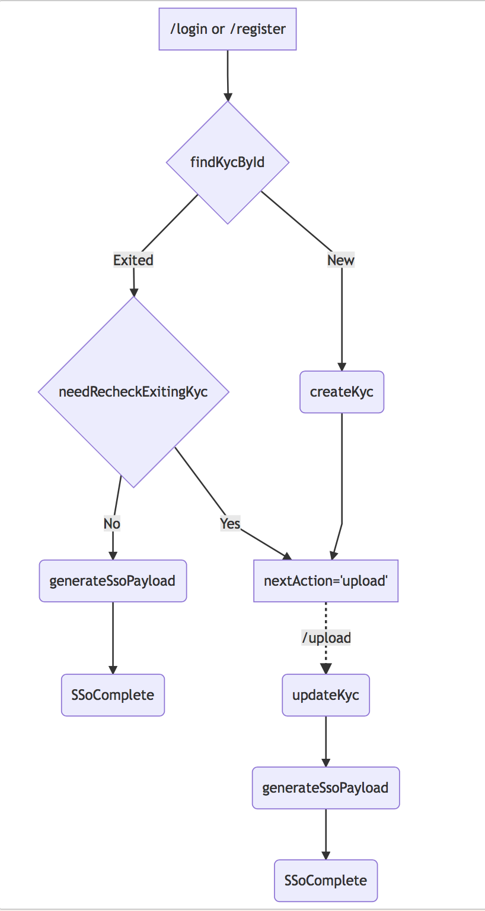

# Blockpass Server SDK

## Terms:
-   **Endpoints**:
    - `/login`: SSO endpoints. Called by mobile app. Triggered by (scan qr code & Applink)
    - `/register`: Registration or re-new certificate request(later). Triggred by press **Register** button on mobile app
    - `/upload`: Upload user rawData. Triggered when **nextAction=upload** returned by `/login` or `/register`

-   **KycProfile**: User profile object return by Blockpass Api
-   **KycToken**: Access token object.Using for exchange data between services and blockpass api (each user will have difference token)
-   **KycRecord**: Object stored kyc data. Managed by Services. It should have 3 parts(BlockpassKycProfile + RawData + Service Extra Info)

Example:

```javascript
{
    //
    //[Blockpass-KycProfile]
    //

    blockpassId: 'service_udid',// udid of user ( unique for each services )
    kycToken: {...}, // kycToken for this user 
    rootHash: 'sha3-hash' // user root of merke tree
    isSynching: "syncing" | "complete" // status of smartcontract syncing

    //
    //[Blockpass-RawData]
    //

    phone: xxx,
    email: yyy,
    [cer]onfido: '....', 

    //
    //[Service Extra info]
    //
    etherAddress: '....'
}
```

## Working Flow:


## Getting Started

-   **Step 1**: Declare logic handler

    1.  `findKycById`: Find and return KycRecord
    2.  `createKyc`: Create new kycRecord
    3.  `updateKyc`: Update kycRecord
    4.  `needRecheckExitingKyc`: Perform logic to request client re-submit data
    5.  `generateSsoPayload`: Generate SSo payload ( this custom data will be sent to web-client )

```javascript
const sdk = new ServerSdk({

    // Developer dashboard fields
    baseUrl: BLOCKPASS_BASEURL,
    clientId: SERVICE_CLIENTID,
    secretId: SERVICE_SECRETID,
    requiredFields: REQUIRED_FIELDS,
    optionalFields: OPTIONAL_FIELDS,

    // Custom implement
    findKycById: findKycById ,
    createKyc: createKyc,
    updateKyc: updateKyc,
    needRecheckExitingKyc: needRecheckExitingKyc,
    generateSsoPayload: generateSsoPayload
})

//-------------------------------------------------------------------------
// blockpassId -> kycRecord
//-------------------------------------------------------------------------
async function findKycById(blockpassId) {
    return await KYCModel.findOne({ blockPassID })
}

//-------------------------------------------------------------------------
// Update create new kycRecord
//-------------------------------------------------------------------------
async function createKyc({ kycProfile }) {
    const { id, smartContractId, rootHash, isSynching } = kycProfile;
    const newIns = new KYCModel({
        blockPassID: id,
        rootHash,
        smartContractId,
        isSynching
    })

    return await newIns.save()
}

//-------------------------------------------------------------------------
// Update rawData -> kycRecord
//-------------------------------------------------------------------------
async function updateKyc({
    kycRecord,
    kycProfile,
    kycToken,
    userRawData
}) {
    const { id, smartContractId, rootHash, isSynching } = kycProfile;

    // Store file and raw data fields -> kycRecord
    const jobs = Object.keys(userRawData).map(async (key) => {
        const metaData = userRawData[key];

        if (metaData.type == 'string')
            return kycRecord[key] = metaData.value

        if (metaData.type == 'file') {
            const { buffer, originalname } = metaData;
            const ext = originalname.split('.')[1];
            const fileName = `${id}_${key}.${ext}`;

            // store file somewhere
            const fileHandler = await FileStorage.writeFile({
                fileName,
                mimetype: `image/${ext}`,
                fileBuffer: buffer
            })

            return kycRecord[key] = fileHandler._id
        }
    })

    const waitingJob = await Promise.all(jobs);

    // [Advance] - Link kyc record with exiting user data in your database
    // Example: This email|phone contain in our database

    kycRecord.bpToken = kycToken
    kycRecord.rootHash = rootHash
    kycRecord.smartContractId = smartContractId
    kycRecord.isSynching = isSynching

    return await kycRecord.save()
}

//-------------------------------------------------------------------------
// Perform checking on exiting kycRecord => generate nextAction for BlockpassClient
//-------------------------------------------------------------------------
async function needRecheckExitingKyc({ kycProfile, kycRecord, payload }) {

    // Check kycRecord missing critical fields ( caused by previous upload error / server crash )
    const missingFields = kycRecord.missingCriticalFields()
    if(missingFields) {
        return {
            nextAction: 'upload',
            requiredFields: missingFields
        }
    }

    // Further checking logic

    // no need re-upload anything. update review status to user
    return {
        nextAction: 'none',
        message: 'user readable review-status'
    };
}

//-------------------------------------------------------------------------
// Kyc successfull. Generate services token for client
//-------------------------------------------------------------------------
async function generateSsoPayload({ kycProfile, kycRecord, kycToken, payload }) {
    return {
        _id: kycRecord._id,
        serviceToken: '...' // AccessToken for services
    }
}
```

-   **Step 2**: Create api:
    1.  /login -> sdk.loginFow(...)
    2.  /upload -> sdk.updateDataFlow(...)
    3.  /register -> sdk.registerFlow(...)


    Ps: See express `examples`

-   **Step 3**: Checking completed kycRecord 

      => Merkle Root check

      [Todo in v2]


    => Check roothash with SmartContract

    [Todo in v3]


    => Approve | Reject decision

    [Todo in v2]

    => Generate certificate

    [Todo in v2]

## Development Commands

```sh
$ npm test # run tests with Jest
$ npm run coverage # run tests with coverage and open it on browser
$ npm run lint # lint code
$ npm run docs # generate docs
$ npm run build # generate docs and transpile code
```

## API

<!-- Generated by documentation.js. Update this documentation by updating the source code. -->

#### Table of Contents

-   [ServerSdk](#serversdk)
    -   [loginFow](#loginfow)
    -   [updateDataFlow](#updatedataflow)
    -   [registerFlow](#registerflow)
    -   [signCertificate](#signcertificate)
    -   [rejectCertificate](#rejectcertificate)
    -   [queryProofOfPath](#queryproofofpath)
    -   [merkleProofCheckSingle](#merkleproofchecksingle)
-   [ServerSdk#kycRecord](#serversdkkycrecord)
-   [ConstructorParams](#constructorparams)
-   [ServerSdk#ConstructorParams](#serversdkconstructorparams)
-   [ServerSdk#findKycByIdHandler](#serversdkfindkycbyidhandler)
-   [ServerSdk#createKycHandler](#serversdkcreatekychandler)
-   [ServerSdk#updateKycHandler](#serversdkupdatekychandler)
-   [ServerSdk#needRecheckExitingKycHandler](#serversdkneedrecheckexitingkychandler)
-   [ServerSdk#generateSsoPayloadHandler](#serversdkgeneratessopayloadhandler)
-   [ServerSdk#kycProfile](#serversdkkycprofile)
-   [ServerSdk#kycToken](#serversdkkyctoken)
-   [ServerSdk#BlockpassMobileResponsePayload](#serversdkblockpassmobileresponsepayload)
-   [ServerSdk#UploadDataRequest](#serversdkuploaddatarequest)

### ServerSdk

**Parameters**

-   `params` **...[ServerSdk#ConstructorParams](#serversdkconstructorparams)** 
    -   `params.baseUrl`  
    -   `params.clientId`  
    -   `params.secretId`  
    -   `params.requiredFields`  
    -   `params.optionalFields`  
    -   `params.findKycById`  
    -   `params.createKyc`  
    -   `params.updateKyc`  
    -   `params.needRecheckExitingKyc`  
    -   `params.generateSsoPayload`  
    -   `params.encodeSessionData`  
    -   `params.decodeSessionData`  

#### loginFow

Login Flow. Which handle SSO and AppLink login from Blockpass client.

-   Step 1: Handshake between our service and BlockPass
-   Step 2: Sync KycProfile with Blockpass
-   Step 3: Create / update kycRecord via handler

**Parameters**

-   `$0` **any** 
    -   `$0.code`  
    -   `$0.sessionCode`  

Returns **[Promise](https://developer.mozilla.org/docs/Web/JavaScript/Reference/Global_Objects/Promise)&lt;BlockpassMobileResponsePayload>** 

#### updateDataFlow

Handle user data upload and fill-up kycRecord

-   Step 1: restore session from accessToken
-   Step 2: validate required fields provided by client vs serviceMetaData(required / optional)
-   Step 3: update raw data to kycRecord

**Parameters**

-   `params` **...[ServerSdk#UploadDataRequest](#serversdkuploaddatarequest)** 
    -   `params.accessToken`  
    -   `params.slugList`  
    -   `params.userRawData` **...any** 

Returns **[Promise](https://developer.mozilla.org/docs/Web/JavaScript/Reference/Global_Objects/Promise)&lt;BlockpassMobileResponsePayload>** 

#### registerFlow

Register fow. Recieved user sign-up infomation and create KycProcess.
Basically this flow processing same as loginFlow. The main diffrence is without sessionCode input

**Parameters**

-   `$0` **any** 
    -   `$0.code`  

Returns **[Promise](https://developer.mozilla.org/docs/Web/JavaScript/Reference/Global_Objects/Promise)&lt;BlockpassMobileResponsePayload>** 

#### signCertificate

Sign Certificate and send to blockpass

**Parameters**

-   `$0` **any** 
    -   `$0.id`  
    -   `$0.kycRecord`  

Returns **[Promise](https://developer.mozilla.org/docs/Web/JavaScript/Reference/Global_Objects/Promise)&lt;[boolean](https://developer.mozilla.org/docs/Web/JavaScript/Reference/Global_Objects/Boolean)>** 

#### rejectCertificate

Reject Certificate

**Parameters**

-   `$0` **any** 
    -   `$0.profileId`  
    -   `$0.message`  

Returns **[Promise](https://developer.mozilla.org/docs/Web/JavaScript/Reference/Global_Objects/Promise)&lt;[boolean](https://developer.mozilla.org/docs/Web/JavaScript/Reference/Global_Objects/Boolean)>** 

#### queryProofOfPath

Query Merkle proof of path for given slugList

**Parameters**

-   `$0` **any** 
    -   `$0.kycToken`  
    -   `$0.slugList`  

#### merkleProofCheckSingle

Check merkle proof for invidual field

**Parameters**

-   `rootHash` **[string](https://developer.mozilla.org/docs/Web/JavaScript/Reference/Global_Objects/String)** : Root hash of kycRecord
-   `rawData` **([string](https://developer.mozilla.org/docs/Web/JavaScript/Reference/Global_Objects/String) \| [Buffer](https://nodejs.org/api/buffer.html))** : Raw data need to be check
-   `proofList` **[object](https://developer.mozilla.org/docs/Web/JavaScript/Reference/Global_Objects/Object)** : Proof introduction ( from queryProofOfPath response)

### ServerSdk#kycRecord

KYC Record Object

Type: [Object](https://developer.mozilla.org/docs/Web/JavaScript/Reference/Global_Objects/Object)

### ConstructorParams

* * *

### ServerSdk#ConstructorParams

Type: [Object](https://developer.mozilla.org/docs/Web/JavaScript/Reference/Global_Objects/Object)

**Properties**

-   `baseUrl` **[string](https://developer.mozilla.org/docs/Web/JavaScript/Reference/Global_Objects/String)** : Blockpass Api Url (from developer dashboard)
-   `clientId` **[string](https://developer.mozilla.org/docs/Web/JavaScript/Reference/Global_Objects/String)** : CliendId(from developer dashboard)
-   `secretId` **[string](https://developer.mozilla.org/docs/Web/JavaScript/Reference/Global_Objects/String)** : SecretId(from developer dashboard)
-   `requiredFields` **\[[string](https://developer.mozilla.org/docs/Web/JavaScript/Reference/Global_Objects/String)]** : Required identities fields(from developer dashboard)
-   `optionalFields` **\[[string](https://developer.mozilla.org/docs/Web/JavaScript/Reference/Global_Objects/String)]** : Optional identities fields(from developer dashboard)
-   `findKycById` **[ServerSdk#findKycByIdHandler](#serversdkfindkycbyidhandler)** : Find KycRecord by id
-   `createKyc` **[ServerSdk#createKycHandler](#serversdkcreatekychandler)** : Create new KycRecord
-   `updateKyc` **[ServerSdk#updateKycHandler](#serversdkupdatekychandler)** : Update Kyc
-   `needRecheckExitingKyc` **[ServerSdk#needRecheckExitingKycHandler](#serversdkneedrecheckexitingkychandler)?** : Performing logic to check exiting kycRecord need re-submit data
-   `generateSsoPayload` **[ServerSdk#generateSsoPayloadHandler](#serversdkgeneratessopayloadhandler)?** : Return sso payload
-   `encodeSessionData` **function ([object](https://developer.mozilla.org/docs/Web/JavaScript/Reference/Global_Objects/Object)): [string](https://developer.mozilla.org/docs/Web/JavaScript/Reference/Global_Objects/String)?** : Encode sessionData to string
-   `decodeSessionData` **function ([string](https://developer.mozilla.org/docs/Web/JavaScript/Reference/Global_Objects/String)): [object](https://developer.mozilla.org/docs/Web/JavaScript/Reference/Global_Objects/Object)?** : Decode sessionData from string

### ServerSdk#findKycByIdHandler

Query Kyc record by Id

Type: [Function](https://developer.mozilla.org/docs/Web/JavaScript/Reference/Statements/function)

**Parameters**

-   `kycId` **[string](https://developer.mozilla.org/docs/Web/JavaScript/Reference/Global_Objects/String)** 

Returns **[Promise](https://developer.mozilla.org/docs/Web/JavaScript/Reference/Global_Objects/Promise)&lt;[ServerSdk#kycRecord](#serversdkkycrecord)>** Kyc Record

### ServerSdk#createKycHandler

Create new KycRecord

Type: [Function](https://developer.mozilla.org/docs/Web/JavaScript/Reference/Statements/function)

**Parameters**

-   `kycProfile` **[ServerSdk#kycProfile](#serversdkkycprofile)** 

Returns **[Promise](https://developer.mozilla.org/docs/Web/JavaScript/Reference/Global_Objects/Promise)&lt;[ServerSdk#kycRecord](#serversdkkycrecord)>** Kyc Record

### ServerSdk#updateKycHandler

Update exiting KycRecord

Type: [Function](https://developer.mozilla.org/docs/Web/JavaScript/Reference/Statements/function)

**Parameters**

-   `kycRecord` **[ServerSdk#kycRecord](#serversdkkycrecord)** 
-   `kycProfile` **[ServerSdk#kycProfile](#serversdkkycprofile)** 
-   `kycToken` **[ServerSdk#kycToken](#serversdkkyctoken)** 
-   `userRawData` **[Object](https://developer.mozilla.org/docs/Web/JavaScript/Reference/Global_Objects/Object)** 

Returns **[Promise](https://developer.mozilla.org/docs/Web/JavaScript/Reference/Global_Objects/Promise)&lt;[ServerSdk#kycRecord](#serversdkkycrecord)>** Kyc Record

### ServerSdk#needRecheckExitingKycHandler

Performing check. Does need re-upload user data or not

Type: [Function](https://developer.mozilla.org/docs/Web/JavaScript/Reference/Statements/function)

**Parameters**

-   `kycRecord` **[ServerSdk#kycRecord](#serversdkkycrecord)** 
-   `kycProfile` **[ServerSdk#kycProfile](#serversdkkycprofile)** 
-   `payload` **[Object](https://developer.mozilla.org/docs/Web/JavaScript/Reference/Global_Objects/Object)** 

Returns **[Promise](https://developer.mozilla.org/docs/Web/JavaScript/Reference/Global_Objects/Promise)&lt;[Object](https://developer.mozilla.org/docs/Web/JavaScript/Reference/Global_Objects/Object)>** Payload return to client

### ServerSdk#generateSsoPayloadHandler

Check need to update new info for exiting Kyc record

Type: [Function](https://developer.mozilla.org/docs/Web/JavaScript/Reference/Statements/function)

**Parameters**

-   `kycRecord` **[ServerSdk#kycRecord](#serversdkkycrecord)** 
-   `kycProfile` **[ServerSdk#kycProfile](#serversdkkycprofile)** 
-   `kycToken` **[ServerSdk#kycToken](#serversdkkyctoken)** 
-   `payload` **[Object](https://developer.mozilla.org/docs/Web/JavaScript/Reference/Global_Objects/Object)** 

### ServerSdk#kycProfile

KYC Profile Object

Type: [Object](https://developer.mozilla.org/docs/Web/JavaScript/Reference/Global_Objects/Object)

**Properties**

-   `id` **[string](https://developer.mozilla.org/docs/Web/JavaScript/Reference/Global_Objects/String)** : Udid of kycProfile (assigned by blockpass)
-   `smartContractId` **[string](https://developer.mozilla.org/docs/Web/JavaScript/Reference/Global_Objects/String)** : SmartContract user ID ( using to validate rootHash via Sc)
-   `rootHash` **[string](https://developer.mozilla.org/docs/Web/JavaScript/Reference/Global_Objects/String)** : Currently Root Hash

### ServerSdk#kycToken

Type: [Object](https://developer.mozilla.org/docs/Web/JavaScript/Reference/Global_Objects/Object)

**Properties**

-   `access_token` **[string](https://developer.mozilla.org/docs/Web/JavaScript/Reference/Global_Objects/String)** : AccessToken string
-   `expires_in` **[Number](https://developer.mozilla.org/docs/Web/JavaScript/Reference/Global_Objects/Number)** : Expired time in seconds
-   `refresh_token` **[string](https://developer.mozilla.org/docs/Web/JavaScript/Reference/Global_Objects/String)** : Refresh token

### ServerSdk#BlockpassMobileResponsePayload

Response payload for Blockpass mobile

Type: [Object](https://developer.mozilla.org/docs/Web/JavaScript/Reference/Global_Objects/Object)

**Properties**

-   `nextAction` **[string](https://developer.mozilla.org/docs/Web/JavaScript/Reference/Global_Objects/String)** : Next action for mobile blockpass ("none" | "upload" | "website")
-   `message` **[string](https://developer.mozilla.org/docs/Web/JavaScript/Reference/Global_Objects/String)?** : Custom message to display
-   `accessToken` **[string](https://developer.mozilla.org/docs/Web/JavaScript/Reference/Global_Objects/String)?** : Encoded session into token ( using share data between multiple steps )
-   `requiredFields` **\[[string](https://developer.mozilla.org/docs/Web/JavaScript/Reference/Global_Objects/String)]?** : Required identitites need to be send throught '/upload'
-   `optionalFields` **\[[string](https://developer.mozilla.org/docs/Web/JavaScript/Reference/Global_Objects/String)]?** : Optional identitites (client can decline provide those info)

### ServerSdk#UploadDataRequest

Upload data from Blockpass mobile

Type: [Object](https://developer.mozilla.org/docs/Web/JavaScript/Reference/Global_Objects/Object)

**Parameters**

-   `accessToken` **[string](https://developer.mozilla.org/docs/Web/JavaScript/Reference/Global_Objects/String)** : Eencoded session data from /login or /register api
-   `slugList` **\[[string](https://developer.mozilla.org/docs/Web/JavaScript/Reference/Global_Objects/String)]** : List of identities field supplied by blockpass client
-   `userRawData` **...[Object](https://developer.mozilla.org/docs/Web/JavaScript/Reference/Global_Objects/Object)** : Rest parameters contain User raw data from multiform/parts request. Following format below:

**Examples**

```javascript
{
 // string fields
 "phone": { type: 'string', value:'09xxx'},

 // buffer fields
 "selfie": { type: 'file', buffer: Buffer(..), originalname: 'fileOriginalName'}

 // certificate fields with `[cer]` prefix
 "[cer]onfido": {type: 'string', valur:'...'}

 ....
}
```

## License

MIT
