# Blockpass Server SDK

## Terms:

-   **Endpoints**:

    -   `/status`: Kyc status endpoints. Called by mobile app. Response **KycRecordStatus**
    -   `/login`: SSO endpoints. Called by mobile app. Triggered by scanning qr code or opening Applink
    -   `/register`: Registration or re-new certificate request (later). Triggred by pressing **Register** button on mobile application
    -   `/upload`: Upload user rawData. Triggered when mobile application receives **nextAction=upload** returned by `/login` or `/register`

-   **KycProfile**: User profile object return by Blockpass Api
-   **KycToken**: Access token object. Use to exchange data between Services and Blockpass API (each user will have different token)
-   **KycRecord**: Object stored kyc data, managed by Services. It usually contains 3 parts(BlockpassKycProfile + RawData + Service Extra Info)

-   **KycRecordStatus**: Object stored kycRecord status following Mobile App format

```javascript
// Format
{
    status: 'notFound|waiting|inreview|approved',
    message: 'summary current status',
    createdDate: 'DateTime KycRecord created',
    identities: [
        {
            slug: 'slug name',
            status: 'recieved|recieved| approved',
            comment: 'reviewer comment'
        },
        //....
    ],
    certificates: [
        {
            slug: 'slug name',
            status: 'recieved|recieved| approved',
            comment: 'reviewer comment'
        },
        //....
    ]
}
```

Example:

```javascript
{
    //
    //[Blockpass-KycProfile]
    //

    blockpassId: 'service_udid',// udid of user ( unique for each services )
    kycToken: {...}, // kycToken for this user 
    rootHash: 'sha3-hash' // user root of merke tree
    isSynching: "syncing" | "complete" // status of smartcontract syncing

    //
    //[Blockpass-RawData]
    //

    phone: xxx,
    email: yyy,
    [cer]onfido: '....', 

    //
    //[Service Extra info]
    //
    etherAddress: '....'
}
```

## Working Flow:



## Getting Started

-   **Step 1**: Declare logic handler

    1.  `findKycById`: Find and return KycRecord
    2.  `createKyc`: Create new kycRecord
    3.  `updateKyc`: Update kycRecord
    4.  `queryKycStatus`: Query KycRecord status
    5.  `needRecheckExistingKyc`: Perform logic to request client to re-submit data
    6.  `generateSsoPayload`: Generate SSo payload (this custom data will be sent to web-client)

```javascript
const sdk = new ServerSdk({

    // Developer dashboard fields
    baseUrl: BLOCKPASS_BASEURL,
    clientId: SERVICE_CLIENTID,
    secretId: SERVICE_SECRETID,
    requiredFields: REQUIRED_FIELDS,
    optionalFields: OPTIONAL_FIELDS,
    certs: OPTIONAL_CERTS,

    // Custom implement
    findKycById: findKycById ,
    createKyc: createKyc,
    updateKyc: updateKyc,
    queryKycStatus: queryKycStatus,
    needRecheckExistingKyc: needRecheckExistingKyc,
    generateSsoPayload: generateSsoPayload
})

//-------------------------------------------------------------------------
// blockpassId -> kycRecord
//-------------------------------------------------------------------------
async function findKycById(blockpassId) {
    return await KYCModel.findOne({ blockPassID })
}

//-------------------------------------------------------------------------
// Update create new kycRecord
//-------------------------------------------------------------------------
async function createKyc({ kycProfile }) {
    const { id, smartContractId, rootHash, isSynching } = kycProfile;
    const newIns = new KYCModel({
        blockPassID: id,
        rootHash,
        smartContractId,
        isSynching
    })

    return await newIns.save()
}

//-------------------------------------------------------------------------
// Update rawData -> kycRecord
//-------------------------------------------------------------------------
async function updateKyc({
    kycRecord,
    kycProfile,
    kycToken,
    userRawData
}) {
    const { id, smartContractId, rootHash, isSynching } = kycProfile;

    // Store file and raw data fields -> kycRecord
    const jobs = Object.keys(userRawData).map(async (key) => {
        const metaData = userRawData[key];

        if (metaData.type == 'string')
            return kycRecord[key] = metaData.value

        if (metaData.type == 'file') {
            const { buffer, originalname } = metaData;
            const ext = originalname.split('.')[1];
            const fileName = `${id}_${key}.${ext}`;

            // store file somewhere
            const fileHandler = await FileStorage.writeFile({
                fileName,
                mimetype: `image/${ext}`,
                fileBuffer: buffer
            })

            return kycRecord[key] = fileHandler._id
        }
    })

    const waitingJob = await Promise.all(jobs);

    // [Advance] - Link kyc record with existing user data in your database
    // Example: This email|phone contain in our database

    kycRecord.bpToken = kycToken
    kycRecord.rootHash = rootHash
    kycRecord.smartContractId = smartContractId
    kycRecord.isSynching = isSynching

    return await kycRecord.save()
}

//-------------------------------------------------------------------------
// Return KycRecord Status for Mobile application
//-------------------------------------------------------------------------
async function queryKycStatus({ kycRecord }) {
    const status = kycRecord.status

    return {
        status,
        message: '',
        createdDate: new Date(),
        identities: [],
        certificates: []
    }
}

//-------------------------------------------------------------------------
// Perform checking on existing kycRecord => generate nextAction for BlockpassClient
//-------------------------------------------------------------------------
async function needRecheckExistingKyc({ kycProfile, kycRecord, payload }) {

    // Check kycRecord missing critical fields ( caused by previous upload error / server crash )
    const missingFields = kycRecord.missingCriticalFields()
    if(missingFields) {
        return {
            nextAction: 'upload',
            requiredFields: missingFields
        }
    }

    // Further checking logic

    // no need re-upload anything. update review status to user
    return {
        nextAction: 'none',
        message: 'user readable review-status'
    };
}

//-------------------------------------------------------------------------
// Kyc successfull. Generate services token for client
//-------------------------------------------------------------------------
async function generateSsoPayload({ kycProfile, kycRecord, kycToken, payload }) {
    return {
        _id: kycRecord._id,
        serviceToken: '...' // AccessToken for services
    }
}
```

-   **Step 2**: Create api:
    1.  /login -> sdk.loginFow(...)
    2.  /upload -> sdk.updateDataFlow(...)
    3.  /register -> sdk.registerFlow(...)
    4.  /status -> sdk.queryStatusFlow(...)


    Ps: See express `examples`

-   **Step 3**: Checking completed kycRecord 

    => Merkle Root check

    [Todo in v2]


    => Check roothash with SmartContract

    [Todo in v3]


    => Approve | Reject decision

    [Todo in v2]

    => Generate certificate

    [Todo in v2]

## Development Commands

```sh
$ npm test # run tests with Jest
$ npm run coverage # run tests with coverage and open it on browser
$ npm run lint # lint code
$ npm run docs # generate docs
$ npm run build # generate docs and transpile code
```

## API

[Documents](./doc/api.md)


## License

ApacheV2
