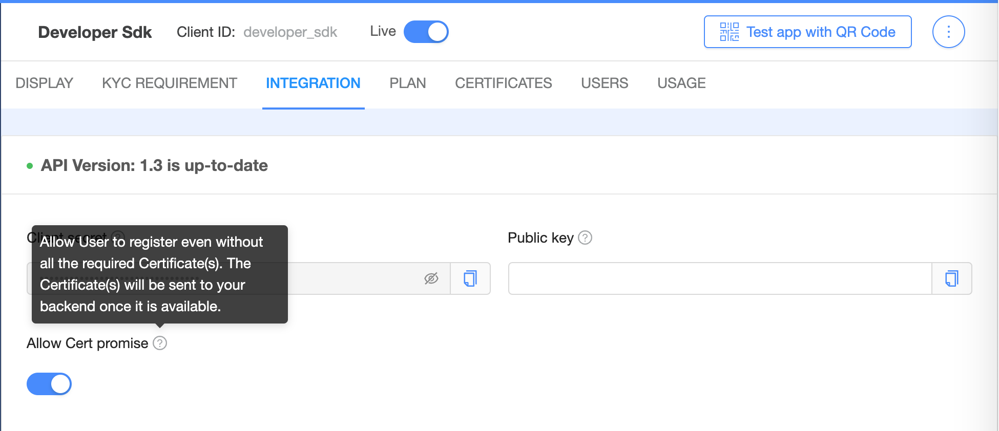
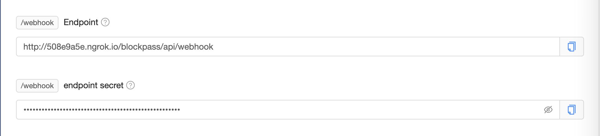

# Certificate Sharing (CertPromise)

## Motivation

TODO

## Working Flow



## Extra setup

1. Enable `Allow Cert promise` (Blockpass Admin Console)
   

2. Update Webhook Endppoint + Webhook Secret (optional)
   

## Flow for Merchant ServerSDK

> Example can be find in `examples/express`

1. in `/status` endpoint. Response `allowCertPromise: true`

```javascript
{
  status: 'notFound',
  allowCertPromise: true,
  identities:
   [ { slug: 'email', status: '' },
     { slug: 'family_name', status: '' },
     { slug: 'given_name', status: '' } ],
  certificates: [ { slug: 'onfido-service-cert', status: '' } ]
}
```

2. in `/webhook`.Fetch certificate raw data and update to KYCRecord

```javascript
router.post('/blockpass/api/webhook', async (req, res) => {
  try {
    console.log('webhook', req.body, req.headers)

    // Check HMAC

    // Processing events
    const action = req.body.action
    switch (action) {
      case 'certPormise.resolved': {
        const { certPromisesId, blockpassID } = req.body.data

        // 1. Lookup record by blockpassID
        const kycRecord = await KYCModel.findOne({ blockPassID: blockpassID })
        const { bpToken } = kycRecord

        // 2. Fetch certificate raw data
        const fetCpResponse = await serverSdk.pullCertPromise({
          bpToken,
          certPromiseId: certPromisesId,
        })
        if (!fetCpResponse)
          return res.status(404).json({
            err: 404,
            msg: 'oop!',
          })

        const { slug, raw } = fetCpResponse

        // 3. update kycRecord
        kycRecord.certs[slug] = {
          slug: slug,
          value: raw,
          status: 'received',
          comment: '',
        }
        kycRecord.status = 'approved'
        await kycRecord.save()

        break
      }
    }

    return res.json({ status: 'success' })
  } catch (ex) {
    console.error(ex)
    return res.status(500).json({
      err: 500,
      msg: ex.message,
    })
  }
})
```

## Appendix - Webhook Payload format

- Method: POST
- Headers:

```javascript
{
  'x-blockpass-event': 'certPormise.resolved', // same as body.action
  'x-blockpass-delivery': 'cb3ecd90-bebc-4d04-9099-44496416f142', // uuid for this delivery

  // HMAC_SHA256(body, webhookSecret)
  'x-blockpass-signature':
   '0404e336017d22a525e35ffecffbb8c307980d7fb0f04d661348171010a8a44b',

  accept: 'application/json',
  'content-type': 'application/json',
  'content-length': '153',
}
```

- JSON Body:

```javascript

// action === 'serviceInfo.updated'
// Service metadata updated
//  - KYC Requirement changed
//  - Integration(endpoints) changed
//  - Billing plan changed
{
  action: 'serviceInfo.updated',
  env: 'QA',
  isPing: false,
  data: { clientId: 'developer_sdk' }
}

// action === 'certPormise.resolved'
// Certificate Promise resolved
{
  action: 'certPormise.resolved',
  env: 'QA',
  isPing: false,
  data:{
    certPromisesId: '5df316xxxxxxxece66',
    blockpassID: '5df31xxxxxxxxx7ece6e'
  }
}
```

## Appendis - CertPromise resolve

Method: GET
Path: `/api/3rdService/merchant/promise/pull/<certPromiseId>`
Header:

- Authorization: `Blockpass accesstoken for record`

Response:

```javascript
{
  slug: 'onfido-service-cert',
  raw:'....'
}
```

Note:

- After Pull successfully (webhook response status `200`), Blockpass Server will delete raw data and deactivate `certPromiseId`. If we trying to perform request after that -> `404` error will response
